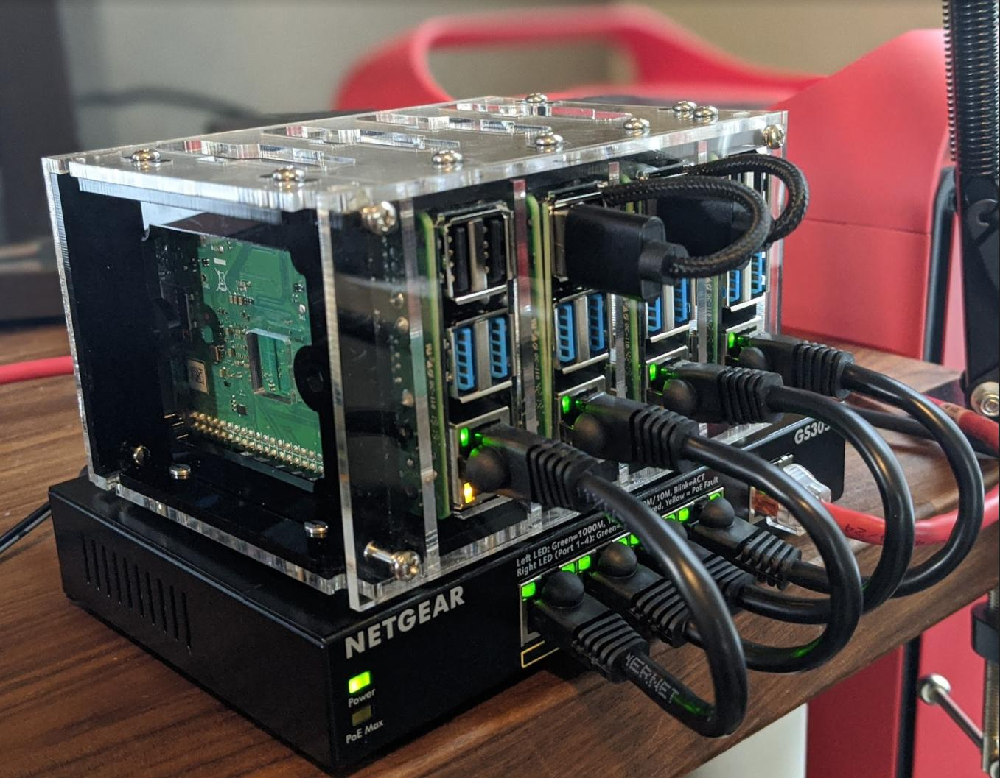

#  Ansible playbooks to build a Kubernetes cluster on Raspberry Pi

The main difference between this playbook and many others, is the abiltiy to build alpha / beta pre-releases of Kubernetes.

I've been part of the Kubernetes release team since 1.12 and always wanted a mini-homelab to test alpha or beta Kubernetes release candidates.



You can read the full setup / build on my [blog](jimangel.io/post/upstream-kubernetes-on-pi/).

### Install Ansible
https://docs.ansible.com/ansible/latest/installation_guide/intro_installation.html

### Clone repo

```
git clone https://github.com/jimangel/pre-release-k8s-on-pi.git
cd repo
```

### Update inventory.yaml

Add each of your IP addresses to a node. Feel free to add more lines if needed.

```
inventory.yaml
```

### Test connection

```
ansible all -m ping
```

### Run playbook

```
ansible-playbook up.yaml

ansible-playbook playbooks/up.yaml --limit "node-0" --tags 'test'

# good artical on excluding certain runs
https://ansible-tips-and-tricks.readthedocs.io/en/latest/ansible/commands/
```